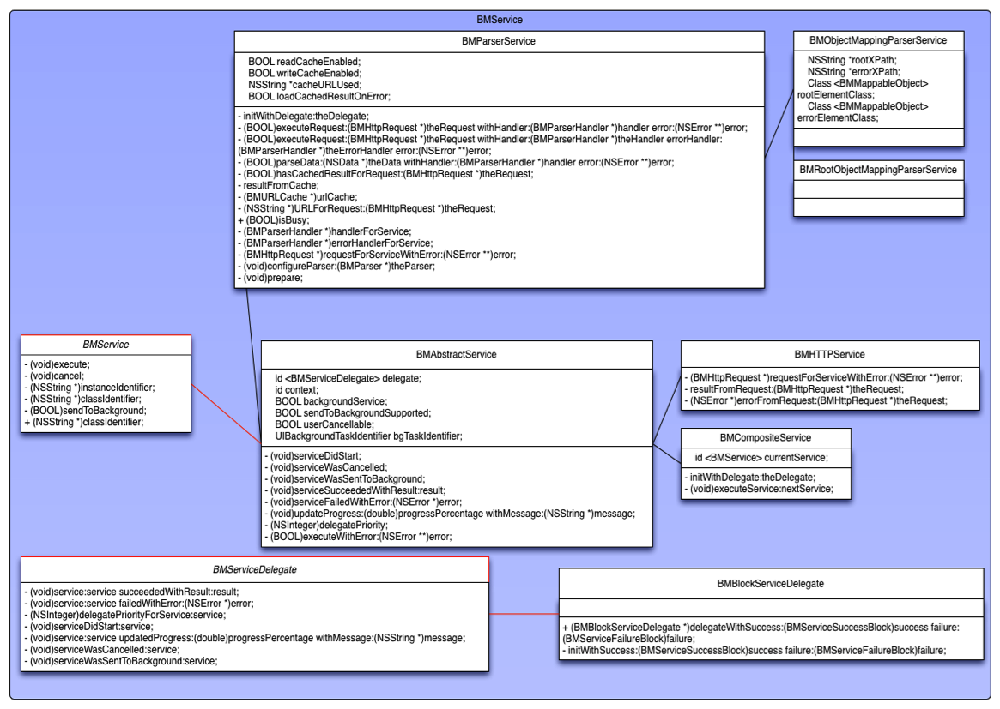

Introduction
----------

The BMService framework is a framework for performing asynchronous
services on iOS/MacOSX. It has the following features:

-   Base classes for defining different kinds of services by extension
    such as basic HTTP services, REST web services, or wrapping third
    party services (such as facebook, twitter, etc)
-   BMServiceManager for performing services in an organized way with
    support for multiple observers/listeners, progress monitoring and
    cancellation.
-   REST support for both JSON and XML by mapping request/response
    messages to objects via configuration via the
    BMObjectMappingParserService class.
-   Support for foreground (visible to the user) and background services
    (happening behind the scenes)
-   Streaming parsing (parsing starts as soon as the first byte is
    downloaded)
-   Parsing in background thread thereby not affecting the
    responsiveness of the user interface
-   Automatic generation of client side classes from a WSDL or XSD
    describing the web service by means of a separate utility 
-   Support for iOS background tasks (ongoing service while the iOS app
    is in background)

The rationale for this framework stems from the following needs for a
common iOS application:

-   Centralized code for showing a busy indicator view and possible
    cancellation whenever the application is busy communicating with a
    server. The BMServiceManager accommodates this need and [BMAppDelegate](BMAppDelegate) in the [BMApplication](BMApplication) module (which is a listener of [BMServiceManager](BMServiceManager)) defines code to show a basic loading indicator, which may be customized.
-   Support for foreground (showing loading indicator) and background services
    (continuing possibly while the app is in inactive state). Also there is
    support for sending a long lasting foreground service to the background.
-   Minimal coding requirements to generate the client side for a
    well-defined REST web service and compile time checking to minimize
    the margin for error.
-   Independency on the message format used (XML or JSON). This should
    be transparent to the model being used.
-   Focus on writing real application logic and move away from
    repetitive boiler plate code (which is both tedious and error prone
    to repeat).

BMService class hierarchy
-------------------------

Above is an UML diagram showing the base protocols and classes involved
in the service framework. Basically every service implements the
[BMService](BMService) protocol which defines an [execute]([BMService execute]) method, a cancel([BMService cancel])
method, a [sendToBackground]([BMService sendToBackground]) method and getters for returning a unique
identifier for both the service instance and this particular class of
services. 

The instance and class identifiers are used by the
BMServiceManager to keep track of the active services and for listeners
to be able to subscribe to updates on an instance level and on a class
level. Listeners are implementations of the [BMServiceDelegate](BMServiceDelegate) protocol
which defines methods for all lifecycle events a service will or may go
through, such as: [start]([BMServiceDelegate serviceDidStart:]), [updateProgress]([BMServiceDelegate service:updatedProgress:withMessage:]), [sendToBackground]([BMServiceDelegate serviceWasSentToBackground:]), [cancel]([BMServiceDelegate serviceWasCancelled:]),
[success]([BMServiceDelegate service:succeededWithResult:]) or [failure]([BMServiceDelegate service:failedWithError:]).

Ordinarily you will never want to implement the [BMService](BMService) protocol
directly, but instead extend the class [BMAbstractService](BMAbstractService), which is a
base implementation of the protocol. This class handles background task
support and defines a number of protected methods which may be called or
overridden by subclasses. In case these methods are overridden be sure
to always call the super implementation with the exception of the
[executeWithError]([BMAbstractService executeWithError:]) method:

-   [serviceDidStart]([BMAbstractService serviceDidStart]), [serviceWasCancelled]([BMAbstractService serviceWasCancelled]), [serviceWasSentToBackground]([BMAbstractService serviceWasSentToBackground]):
    called when the service was started/cancelled/sent to background,
    default implementation notifies the delegates of the respective
    action.
-   [serviceSucceededWithResult]([BMAbstractService serviceSucceededWithResult:]): called when the service succeeds,
    default implementation notifies the delegates. This is the most
    important candidate method to be overridden by subclasses to do
    something with a successful result, such as inserting information in
    the database or translating the result from the service to a result
    that is usable by the application.
-   [serviceFailedWithError]([BMAbstractService serviceFailedWithError:]): called when the service fails default
    implementation notifies the delegates.
-   [executeWithError]([BMAbstractService executeWithError:]): override this method to implement the service
    logic. The input parameters should also be validated and returned in
    an appropriate NSError object in case validation fails.

There are three noteworthy sub classes of BMService which will be
discussed in the next paragraphs.

BMHTTPService
-------------

Implementation for a simple HTTP service for which the implementor is
responsible for parsing the result. This class defines three methods
designed to be overridden by sub classes:

-   [requestForServiceWithError]([BMHTTPService requestForServiceWithError:]): returns a [BMHTTPRequest](BMHTTPRequest) object for
    performing the HTTP request. BMHTTPRequest is a wrapper around
    NSURLRequest which adds functionality to define (multipart) POST,
    PUT, DELETE or GET requests, read or write using streams (for not
    running into memory problems) and support for multiple ways of
    authentication (including Basic, NTLM, client certificate).
-   [resultFromRequest]([BMHTTPService resultFromRequest:]): override this method to parse the response into
    a result object which is the output of the service.
-   [errorFromRequest]([BMHTTPService errorFromRequest:]): override this method for error support. If this
    method returns a non-nil NSError object the service fails with this
    error. This method is always called before [resultFromRequest]([BMHTTPRequest resultFromRequest:]).
    
BMParserService
--------------

The [BMParserService](BMParserService) is designed for implementing XML/JSON HTTP services.
Two sub classes of [BMParser](BMParser) exist for this purpose: [BMXMLParser](BMXMLParser) and
[BMJSONParser](BMJSONParser) that both implement the same protocol and support the same
delegate protocol. BMParser is a SAX-style parser, which means it is
event driven.

BMParserService has the following features:

-   BMHTTPRequest support like the BMHTTPService for initiating the
    service
-   Asynchronous (background thread) parsing of the result from the
    service using either a BMJSONParser or BMXMLParser (parser class is
    configurable).
-   Streaming parsing (parsing starts as soon as the first byte is
    received as response)
-   Handling of the parsed response using a BMParserHandler for mapping
    both the successful response and the error response
-   Caching support for caching the parsed result.

See the code documentation in [BMParserService](BMParserService) for a description of the
responsibility of all methods in the BMParserService class. Most
important for sub classes are the following:

- [handlerForService]([BMParserService handlerForService]);
- [errorHandlerForService]([BMParserService errorHandlerForService]);
- [requestForServiceWithError:]([BMParserService requestForServiceWithError:]);
- [configureParser:]([BMParserService configureParser:]);
- [prepare]([BMParserService prepare]);

BMObjectMappingParserService
----------------------------

This sub class of [BMParserService](BMParserService) uses a [BMObjectMappingParserHandler](BMObjectMappingParserHandler) as
parser handler. This handler maps XML/JSON to objects using declarative
configuration based on [BMAbstractMappableObject](BMAbstractMappableObject).

The procedure is as follows:

-   Given the definition of the XML/JSON returned by the server create
    an object model which maps to this response. All model classes
    should sub class BMAbstractMappableObject. 
-   Configure the mappings between the response and the object model by
    implementing methods defined by BMAbstractMappableObject.
-   Define what is the root object class and root XPath in the response
    from which the mapping should start. Optionally this may also hold
    for the error response. Both are configurable in the
    BMObjectMappingParserService by means of the rootXPath/errorXPath
    and the rootElementClass/errorElementClass.

After this is done correctly the service automatically maps the response
to the defined object model. 

Take a look at the [examples](Binaries/Examples.zip) for more examples on how to use this class and perform mapping.
Also take a look at the [BMMappableObject](BMMappableObject) protocol.

BMCompositeService
------------------

Sometimes a service consists of calling two or more consecutive other
services before a meaningful result can be returned. Think of a service
that requires some authentication protocol or an upload process which
requires multiple consecutive requests.

To be able to manage those services as an atomic unit of work the class
[BMCompositeService](BMCompositeService) exists, which should be sub-classed by concrete
services.

The main method of BMCompositeService is: [executeNextService:]([BMCompositeService executeNextService:] which
can be used to call the next service in sequence until the final service
is executed correctly. Be default the BMCompositeService fails if any of
the underlying services executed returns an error response.

MappableObjectGenerator
-----------------------

For REST services or SOAP services that are well-defined using an XSD
schema mappable objects can be generated automatically using a MacOSX
tool called *MappableObjectGenerator* (included in the Bin directory of this project). Basically this is a command line
utility which takes an XSD-schema as input and four template files for
generating a mapped object model from the schema for use by the
BMObjectMappingParserService.

The four template files are two sets of .h and .m files: one set is for
generating an underscore prefixed class which is not meant to be
modified by the user and one set is for a non-underscore version of this
class which inherits from the underscore-prefixed class and may be
modified by the user. The underscore class is generated each time (at
least if something in the XSD has changed) but the non-underscore
version is left untouched if it already exists.

Normally you will want to use the MappableObjectGenerator as part of the
build process to automatically generate the mapped objects as a
pre-compilation step. Optionally the WSDL or XSD schema that contains
the schema definition can be downloaded automatically beforehand so
always the latest version is used in the compilation.

Example AppDelegate implementation
------------------------

The code below shows how to instantiate a loading indicator on BMService activity (implemented in BMAppDelegate)

    #pragma mark - Private methods
    
    - (void)showAlertForService:(id <BMService>)service withError:(NSError *)error {
        if (!service.isBackgroundService && !service.isErrorHandled) {
            //Show alert on error
        }
    }

    - (void)pushForegroundService:(id <BMService>)service {
        //Keep track of whether cancel button should be enabled or not. Only for services that are cancellable by the user
        [_activeForegroundServices setObject:[NSNumber numberWithBool:service.isUserCancellable] forKey:service.instanceIdentifier];
        BOOL cancelEnabled = YES;
        for (id key in _activeForegroundServices) {
            NSNumber *n = [_activeForegroundServices objectForKey:key];
            cancelEnabled = cancelEnabled && [n boolValue];
        }
        
        [self showBusyViewWithCancelEnabled:cancelEnabled backgroundEnabled:service.isSendToBackgroundSupported];
        
        //Disable the idle timer of the app, thereby preventing it to go on standby
        [UIApplication sharedApplication].idleTimerDisabled = YES;
    }

    - (void)popForegroundService:(id <BMService>)service {
        //Pop the foreground service
        [_activeForegroundServices removeObjectForKey:service.instanceIdentifier];
        if (_activeForegroundServices.count == 0) {
            //If no active foreground services are present anymore: hide the busy view
            [self hideBusyView];
            [UIApplication sharedApplication].idleTimerDisabled = NO;
        }
    }

    - (void)pushService:(id <BMService>)service {
        if (!service.isBackgroundService) {
            [self pushForegroundService:service];
        }
        _serviceCount++;
    }

    - (void)popService:(id <BMService>)service {
        if (service) {
            if (!service.isBackgroundService) {
                [self popForegroundService:service];
            }
            _serviceCount--;
        }
    }

    #pragma mark - BMServiceDelegate implementation 

    - (void)serviceDidStart:(id <BMService>)service {
        //Push the service on the stack: will show busy view if the service is a foreground service
        [self pushService:service];
    }

    - (void)service:(id <BMService>)service succeededWithResult:(id)result {
        //Pop the service from the stack will hide the busy view if there are no foreground services anymore
        [self popService:service];
    }

    - (void)service:(id <BMService>)service updatedProgress:(double)progressPercentage withMessage:(NSString *)message {
        if (!service.isBackgroundService) {
            //Update the busy view progress and message
            [self updateBusyViewWithMessage:message andProgress:progressPercentage];
        }
    }

    - (void)service:(id <BMService>)service failedWithError:(NSError *)error {
        [self popService:service];
        
        //Show an error alert in a generic way
        [self showAlertForService:service withError:error];
    }

    - (void)serviceWasCancelled:(id <BMService>)service {
        //Pop the service also on cancellation
        [self popService:service];
    }

    - (void)serviceWasSentToBackground:(id<BMService>)service {
        //Foreground service becomes a background service
        [self popForegroundService:service];
    }

